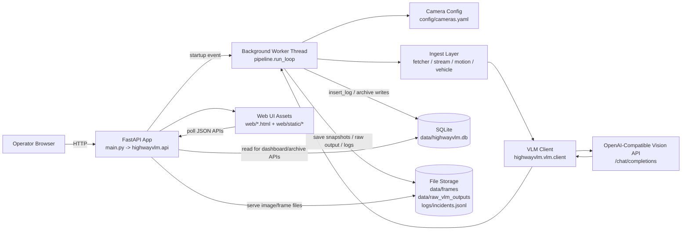

# HighwayVLM System Design Diagram

## High-Level Architecture



## Runtime Tick Flow (Per Camera)

```mermaid
flowchart TD
  A[Tick begins<br/>SYSTEM_INTERVAL_SECONDS]
  B[Load cameras + per-camera state]
  C[Process cameras concurrently<br/>ThreadPoolExecutor]
  D[Fetch frame(s)<br/>HLS path or snapshot path]
  E[Local CV checks<br/>motion + YOLO vehicle count]
  G{Escalate to VLM?}
  H[Skip VLM<br/>persist CV-only result]
  I[Call VLM analyze_comparison]
  J[Validate + normalize JSON result]
  K[Incident confirmation logic<br/>pending/confirmed/filtered]
  L[Persist rows + files<br/>SQLite + snapshots + raw response]
  M[Frontend polls APIs<br/>/api/logs/latest /api/incidents /api/hourly]

  A --> B --> C --> D --> E --> G
  G -- No --> H --> L
  G -- Yes --> I --> J --> K --> L --> M
```

## Main Interfaces

- HTML/UI routes: `/`, `/incidents`, `/hourly`, `/overnight`, `/debug`
- Data APIs: `/api/logs/latest`, `/api/incidents`, `/api/hourly`, `/api/archive/overview`, `/api/debug/stats`
- Health: `/health`, `/api/health`

